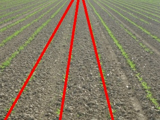
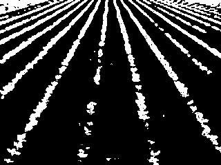
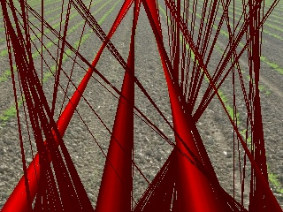
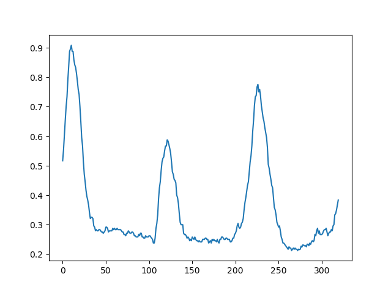
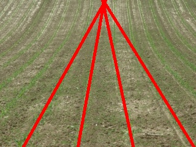
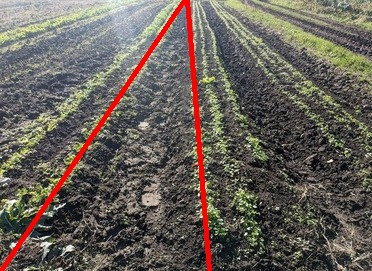

# Row Crop Detection

_Computer Vision Project for A Computational Introduction to Robotics (CompRobo), Olin College Fall 2023_

## Background

For this computer vision project, I decided to explore methods of detecting rows of crops in a field. In the field of agricultural robotics (specifically ground robots), it is important to understand where rows of plants are, especially for navigation purposes. This is a fundamental aspect of ground-based agriculture robots, as they need to be able to follow rows of crops along contours in the field. This helps avoid trampling crops, and facilitates accuracy in the primary purpose of the robot (e.g. precision weeding, spraying, etc).

### Project Goal

Working solo, I decided to avoid overscoping this project. My goal was to explore what methods exist to detect rows of crops. To accomplish this, I went with a two-fold approach: implement a simple algorithm myself, and then play with an existing, more complex algorithm and compare them.

I decided to use existing field robot image datasets to validate my algorithm, as I wanted to focus on the algorithm, rather than the integration into a robot. In addition, I was able to run my algorithm on some images I took while visiting a local farm for my agricultural robotics research project.

## The Simple Algorithm

The methodology of my simple algorithm is based on a combination of strategies used in this class with the algorithm described in the 2012 paper [_Crop Row Detection in Maize Fields Inspired on the Human Visual Perception_](https://www.hindawi.com/journals/tswj/2012/484390/). Although I did not implement their algorithm in full, and mine is not nearly as robust, I took inspiration from their general methodology.

In addition, I have used the [_Crop Row Benchmark Dataset_](http://www.etfos.unios.hr/r3dvgroup/index.php?id=crd_dataset) as the testing data for my algorithm. I have not taken advantage of the CRBD's ability to benchmark crop detection algorithms, I have simply used their image set as the input to my program.

In my simple model, I have made the following assumptions:

- Rows of crops are indicated by groupings of green pixels
- Rows do not necessarily need to be continuous
- All rows are assumed to be straight, as even if the row approximation doesn't quite match the curvature of the row, the guess is close enough to make basic navigational decisions

The steps taken in my model are as follows:

### Find Green Pixels

To find the green pixels in the chosen image, I first convert the image from BGR (blue, green, red) to HSV (hue, saturation, value). This allows me to make a better guess as to which pixels are green. Then, I use minimum and maximum thresholds for each of these 3 attributes to determine which pixels in the image are green. This creates a copy of the image in a binary form, where pixels determined to be green are truthy and other pixels are falsy.

In the current state of this project, the threshold values used to create this binary image are hard-coded. However, I am interested in exploring adaptive thresholding and other strategies to allow my program to adapt to different lighting and field conditions. This could look like filtering the whole image to normalize the lighting conditions and colors, or removing outlier green pixels (such as weeds) to leave behind clearer swaths of green (rows of crops).

Shown here is an example of a binary image generated by my program.

### Counting Pixels

The core strategy of my algorithm is to find lines which contain the greatest number of green pixels. The method of doing so is based on the bottom row of pixels in the image. For each bottom pixel, the following steps are run:

- Calculate a line from this particular bottom pixel to each of the pixels along the top row of the image.
- For each of these lines, count the number of "on" pixels in the binary image.
- Determine which of these lines has the greatest count of green pixels. This line is assumed to be the "best guess" for a line originating from this particular bottom pixel.

If visualized that this stage of the process, the image looks like this:

This is the same image used above, but each bottom pixel has a "best guess". The saturation of the lines is proportional to the count of green pixels along that line. This is useful to visualize which of the lines are actually good guesses (or close) and which are not. Another way to visualize this is with a plot of the counts, where the X axis is the bottom pixel where the line originates and the Y axis is the ratio of green pixels to all pixels for each given line:

### Finding the Rows

To actually find which of these lines are good guesses, and should therefore represent the rows, a few steps are needed. Essentially, the goal is to get each of the peaks, or local maxima, to represent the rows.

First, I applied a Savitzky-Golay filter to the data, to smooth it. This was implemented because of a bug where a peak would have multiple "maximum" points of equal intensity, and the peak wouldn't be properly selected. After filtering, the data is plugged into a SciPy function to calculate the relative maxima.

Both the filter and the maxima finder take a series of parameters. I manually tuned these to find values that make sense, although I envision a future iteration of this project where these are tuned further and maybe defined programmatically. For instance, the maxima finder take an argument for how many points in each direction the function should look to see if the current point is a maximum. I have defined this to be the width of the image divided by 5, assuming that the bottom of the image will include no more than 5 crop rows. This allows the function to avoid double-counting wide rows or accidentally counting weeds between rows.

Once the best estimates are calculated, they are overlaid onto the original image and displayed.

## Results

Below are a few output images from my program. Both of these images are from the CRBD dataset, and while they are some of the more accurate results calculated by my algorithm, they represent the potential in my model once some changes are made to increase robustness in less-than-optimal conditions.

This third image is actually taken by me on a recent visit to a local farm as part of my agricultural robotics research project. Although the purpose of the visit was to talk to the farmer, I snapped a picture of one of the fields and was pleasantly surprised with the result when I plugged it into my project!

## The Complex Algorithm

After writing my algorithm, I took a brief look at the much more recent (2021) paper [_Towards agricultural autonomy: crop row detection under varying field conditions using deep learning_](https://arxiv.org/pdf/2109.08247.pdf). This method utilizes deep learning to combat a number of the issues I encountered in my own exploration. The researchers noted performance improvements when compared to classical detection methods in conditions that I noticed the accuracy of my model degrading. These include uneven lighting, curved or sloped rows, and fields with considerable weed presence. I would be interested in exploring machine learning applications in agricultural robotics in the future, but am happy with how my very simple algorithm turned out.

## Next Steps

A few additions that I believe would make my algorithm more robust are:

- Determining the points at which any given pair of lines intersect to calculate a rough estimate for a vanishing point. Then removing lines that intersect at locations far from that point. For instance, if there is a line at a much steeper angle than the rest, intersecting with the other lines in the center of the image, that line should be removed because it's nowhere near the vanishing point.
- Adding simple curve fitting to the lines to compensate for curving rows or elevation change in the field.
- Adding adaptability to lighting condition/crop colors.
- Rejecting green sections that are unlike to be rows (i.e. trees in the background).
- Calculating a robot trajectory from the rows, for instance commanding the robot to drive toward the vanishing point of the row estimates.
- Grouping green pixels and drawing lines between these groups, instead of individual pixels. This would remove weeds and other outliers.
- Integrate my algorithm with the _Crop Row Benchmark Dataset_, allowing proper benchmarking of its accuracy.

Overall, I feel that this project gave me a great introduction to computer vision for agricultural robots, and am excited to potentially apply the concepts I learned in this project to my current research and future development of Olin's entry in the Farm Robotics Challenge!
